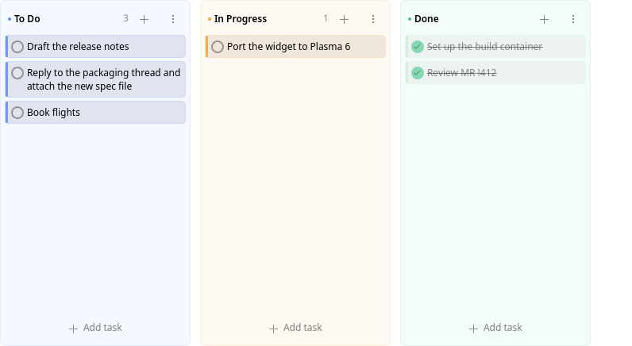
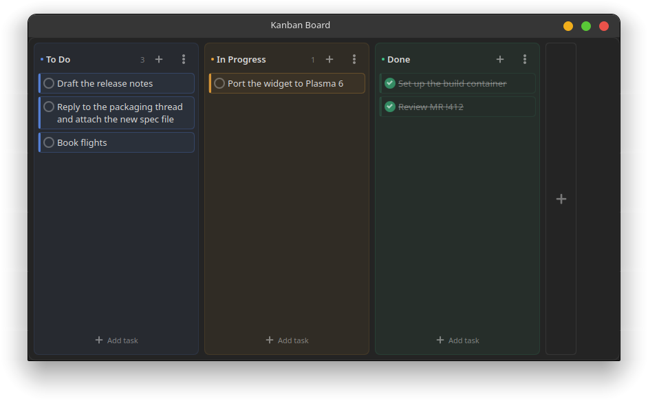

# Kanban Board — Plasma 6 widget

A minimal kanban board that lives on your KDE desktop (or in a panel).
Pure QML/KPackage — no compilation needed.





## Install

```bash
./install.sh
```

Then right-click the desktop → **Add Widgets…** → **Kanban Board**.

Run `./install.sh` again after any edit. **A widget already on the desktop will
keep running the old QML**: plasmashell holds it in memory and also keeps a
compiled QML disk cache, so an upgrade alone changes nothing on screen. To
install, drop the cache and restart the shell in one go:

```bash
./install.sh --restart
```

Remove with `./uninstall.sh`.

## Use

| Action | How |
| --- | --- |
| Add a task | `+` in a list header, or the **Add task** row at the bottom |
| Add several in a row | keep typing — the field stays open after <kbd>Enter</kbd> |
| Complete a task | click the circle |
| Flag a task as important | hover it, click the ☆ — the card gets a red frame |
| Edit a task | double-click it |
| Delete a task | hover it, click the ✕ (or clear the text while editing) |
| Move a task | drag it — within a list or across lists |
| Rename a list | double-click its name, or ⋮ → *Rename list* |
| Split a list | ⋮ → *Split into sections* — then name the new block |
| Add another section | the **Add section** row at the bottom of a split list |
| Rename a section | double-click its name, or its ⋮ → *Rename section* |
| Collapse a section | the arrow button left of its name |
| Reorder sections | section ⋮ → *Move up / Move down* |
| Undo the split | ⋮ → *Merge sections* |
| Recolor a list | click the dot next to its name |
| Add / remove / reorder lists | the `+` panel at the right end of the board, ⋮ → *Move left/right*, *Delete list* |
| Clear finished work | ⋮ → *Clear completed* (per list, or per section) |

An important card keeps its list's colour and gains a solid red frame. No list
accent is red — the palette is blue, amber, green, violet, teal — so the frame
never competes with a column, and it stays on the card when it is dragged
elsewhere.

<kbd>Esc</kbd> cancels any inline edit.

## Sections

A list can be split vertically into named blocks — *Research* → **WIP / Writing
/ Review** — instead of spreading one workflow over several boards. Blocks stack
inside the list they belong to, keep the list's colour, and are drop targets in
their own right: dragging a card between two blocks of the same list is the same
gesture as dragging it to another list.

A block is exactly as tall as the cards in it — one card is one card's worth of
list, not a fixed slice of it — and it grows and shrinks as cards come and go.
An empty block folds itself down to its title strip and unfolds the moment a
card lands in it, so a *Review* nobody is using costs one line instead of a
third of the list. The arrow button opens one anyway — to type straight into it
— and folding a block by hand sticks until you open it again. A folded block is
still a drop target: drop a card on the strip and it opens.

Splitting a list that already holds cards keeps them together in a block named
*Unsorted*; rename it and carry on. Deleting a block never deletes work — its
cards join the block above it (or below, for the first one) — and *Merge
sections* folds everything back into one plain list, in order.

A list nobody has split has no section chrome at all, so an unsplit board looks
and behaves exactly as before.

## Settings

Right-click the widget → **Configure Kanban Board…**: background opacity
(0–100%; the widget paints its own background, so this is a real slider), list
width, per-list task counters, compact cards, and strike-through or hiding of
completed tasks. The board name is used only for the panel tooltip.

## Where the data lives

The board is stored as JSON in the widget's own config, so every instance keeps
its own board and it survives restarts. Each list holds a list of sections; a
board written before sections existed (`version: 1`) is read as one nameless
section per list and rewritten as `version: 2` on the next change:

```
~/.config/plasma-org.kde.plasma.desktop-appletsrc
```

## Layout

```
package/
  metadata.json                 plugin id, icon, category
  contents/
    config/main.xml             config keys + defaults
    config/config.qml           config page list
    ui/main.qml                 applet root: board model, load/save, header
    ui/KanbanColumn.qml         one list: header, section stack, scroller, menu
    ui/KanbanSection.qml        one block of a list: cards, drop target, menu
    ui/TaskCard.qml             one card: check, star, text, edit, drag source
    ui/TaskComposer.qml         inline "add task" field
    ui/configGeneral.qml        settings page
tests/run.sh                    headless behaviour tests (qmltestrunner)
```

Tasks are held in the section model as JSON, not only inside the delegates, so a
rebuilt or scrolled-away column can never lose them.

## Tests

```bash
./tests/run.sh
```

Runs the list/card/section logic (add, edit, complete, flag as important, drag
between lists and between sections, reorder, split, collapse, delete and merge
sections, clear completed, write-back) headlessly with `qmltestrunner-qt6`.

## Requirements

Plasma 6, Qt 6, KDE Frameworks 6. Developed against Plasma 6.7 / Qt 6.11.
